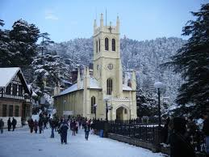

# Neural Style Transfer (NST) — PyTorch (VGG19)

This repository implements **Neural Style Transfer** using a pretrained **VGG-19** network in PyTorch.
The project generates a stylized image (or GIF) by combining the **content** of one image with the **style** of another using feature correlations (Gram matrices).

The model was developed and tested on an **NVIDIA GTX 1650 (4GB VRAM)**.

---

## Features

* VGG-19 feature extractor with **AvgPooling** (instead of MaxPooling)
* Content & style loss using **Gram matrices**
* Optimization via **L-BFGS**
* Optional **random noise** or **content image** initialization
* Periodic frame capture → **animated GIF**
* CUDA support with automatic CPU fallback

---

## Model Architecture

* Backbone: **VGG-19 (ImageNet pretrained)**
* Feature layers used:

### Content Layer

```
conv4_2
```

### Style Layers

```
conv1_1
conv2_1
conv3_1
conv4_1
conv5_1
```

MaxPooling layers are replaced with **AvgPooling** to improve gradient smoothness and visual quality.

---

## Hardware & Performance

| Component  | Value           |
| ---------- | --------------- |
| GPU        | NVIDIA GTX 1650 |
| VRAM       | 4 GB            |
| Image Size | ≤ 512 px        |
| Iterations | 300             |
| Optimizer  | L-BFGS          |

> The project is optimized to fit comfortably within **4GB VRAM**.

---

## 🎨 Neural Style Transfer Result

### Content Image


### Style Image


### Stylized Output (Optimization Progress)


---

## Requirements

```bash
pip install torch torchvision pillow
```

Tested with:

* Python ≥ 3.9
* PyTorch ≥ 2.0
* Torchvision ≥ 0.15

---

## Project Structure

```
.
├── nst/
│   ├── VGG.py              # VGG feature extractor
│   ├── gram_matrix.py      # Gram matrix computation
│   └── live_viewer.py      # Tensor → PIL conversion
│
├── content-1.jpg
├── style.jpg
├── style_transfer.py
└── README.md
```

---

## Usage

### 1. Prepare Images

Place your images in the project root:

```text
content-1.jpg   # Content image
style.jpg       # Style reference
```

### 2. Run Style Transfer

```bash
python -m nst.main
```

### 3. Output

* Final result saved as:

```text
style_transfer-2.gif
```

Each frame represents optimization progress.

---

## Key Hyperparameters

```python
alpha = 1        # Content weight
beta  = 1e4     # Style weight
num_steps = 300
CAPTURE_EVERY = 5
```

### Initialization Options

```python
# Content initialization (more stable)
generated = content.clone().requires_grad_(True)

# Noise initialization (more artistic)
generated = torch.randn_like(content).requires_grad_(True)
```

---

## Loss Functions

### Content Loss

Mean-squared error between generated and content features:

L_content = ‖F_gen^(conv4_2) − F_content^(conv4_2)‖²

---

### Style Loss

Gram matrix MSE across style layers:

L_style = Σ_l ‖G_gen^l − G_style^l‖²

---

### Total Loss

L = α · L_content + β · L_style


---

## Normalization

Images are normalized using ImageNet statistics:

```python
mean = [0.485, 0.456, 0.406]
std  = [0.229, 0.224, 0.225]
```

De-normalization is applied before saving frames.

---

## Notes

* `model.eval()` and `requires_grad=False` ensure the VGG network is **frozen**
* `LBFGS` requires a closure function (handled correctly)
* Clamping is optional and commented out to preserve texture richness

---

## Known Limitations

* High-resolution images (>512px) may exceed GTX 1650 VRAM
* L-BFGS is memory-intensive compared to Adam
* No batch processing (single image NST)

---

## References

* Gatys et al., *A Neural Algorithm of Artistic Style*
* PyTorch VGG-19 pretrained on ImageNet

---

## Author
Prabhsurat Singh

Developed as a **from-scratch PyTorch NST implementation**, optimized for **consumer GPUs**.
